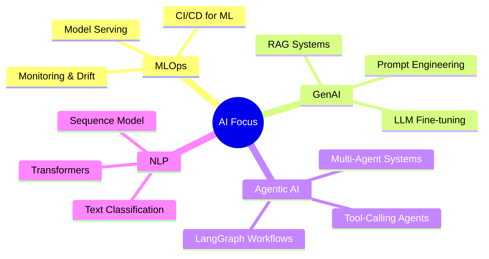

<div align="center">


</div>

---

## 🧬 About Me

```python
class SujanShrestha:
    def __init__(self):
        self.name         = "Sujan Shrestha"
        self.role         = ["AI / ML Engineer", "Data Scientist"]
        self.location     = "Nepal 🇳🇵"
        self.education    = "Electronics, Communication & Information Engineering"

        self.expertise    = {
            "core"        : ["Machine Learning", "Deep Learning", "NLP", "Generative AI"],
            "agentic_ai"  : ["LangChain", "LangGraph", "RAG Systems", "LLM Pipelines"],
            "deployment"  : ["FastAPI", "Streamlit", "Docker", "AWS"],
            "data"        : ["PostgreSQL", "MySQL", "MSSQL"],
        }

        self.currently    = "Building production-grade AI pipelines & agentic systems"
        self.learning     = ["MLOps", "LLM Fine-Tuning", "Multimodal AI"]
        self.open_to      = "Collaborations on AI/ML research & open-source projects"
        self.fun_fact     = "I train models the way I train patience — slowly, iteratively, with coffee ☕"

    def greet(self):
        return "Let's build something intelligent together 🚀"
```

---

## 📊 GitHub Analytics

<div align="center">


</div>

<br/>

<div align="center">


&nbsp;


</div>

<br/>

<div align="center">
  
</div>

---

## 🛠️ Tech Stack & Skills

### 🐍 Core Language
<p align="left">
  
</p>

### 🤖 AI / ML / DL
<p align="left">
  
  
  
  
  
  
  
</p>

### 🕸️ Agentic AI & LLM Frameworks
<p align="left">
  
  
  
</p>

### 🚀 Frameworks & APIs
<p align="left">
  
  
</p>

### 🗄️ Databases
<p align="left">
  
  
  
</p>

### ☁️ Cloud, DevOps & Tools
<p align="left">
  
  
  
  
  
</p>

---

## 🎯 Current Focus Areas

<div align="center">


</div>

<br/>

<div align="center">



---

<table>
  <thead>
    <tr>
      <th>🚀 Domain</th>
      <th>🔬 Focus</th>
      <th>📊 Progress</th>
    </tr>
  </thead>
  <tbody>
    <tr>
      <td>🤖 <b>Machine Learning</b></td>
      <td>Production Pipelines &amp; Model Serving</td>
      <td></td>
    </tr>
    <tr>
      <td>🧠 <b>Deep Learning</b></td>
      <td>ViT · EfficientNet · ResNet</td>
      <td></td>
    </tr>
    <tr>
      <td>💬 <b>NLP &amp; GenAI</b></td>
      <td>LLM Apps · RAG · Fine-tuning</td>
      <td></td>
    </tr>
    <tr>
      <td>🕸️ <b>Agentic AI</b></td>
      <td>LangGraph · Multi-Agent · Tools</td>
      <td></td>
    </tr>
    <tr>
      <td>☁️ <b>MLOps &amp; AWS</b></td>
      <td>CI/CD for ML · Drift · EC2</td>
      <td></td>
    </tr>
    <tr>
      <td>🛢️ <b>Data Engineering</b></td>
      <td>PostgreSQL · MSSQL · Pipelines</td>
      <td></td>
    </tr>
  </tbody>
</table>

</div>

---

## 💻 AI Coding

<div align="center">
  
</div>

---

## 🤖 Robotics & AI Interests

<div align="center">

> *"From writing code to watching machines think, move, and fly — this is what drives me."*

</div>

<br/>

<table align="center">
<tr>
<td align="center" width="33%">

**💻 AI Coding**
<br/>
Writing intelligent pipelines,<br/>training models, deploying agents

</td>
<td align="center" width="33%">

**🦾 Robotics**
<br/>
Autonomous systems, robotic control,<br/>human-robot interaction

</td>
<td align="center" width="33%">

**🚁 Drones & UAVs**
<br/>
Autonomous navigation,<br/>computer vision for drones

</td>
</tr>
</table>

<br/>

<div align="center">
  
</div>


## 🤝 Connect With Me

<div align="center">

[](https://linkedin.com/in/suzan-shrestha)
[](mailto:suzanstha203@example.com)
[](https://github.com/Sujan122321)
[](https://kaggle.com/sujanshrestha)

</div>

---

## 🏷️ Pronouns &nbsp; `He / Him`

---

<div align="center">


*"Intelligence is not just about learning — it's about learning to generalize."* 🧠✨

</div>